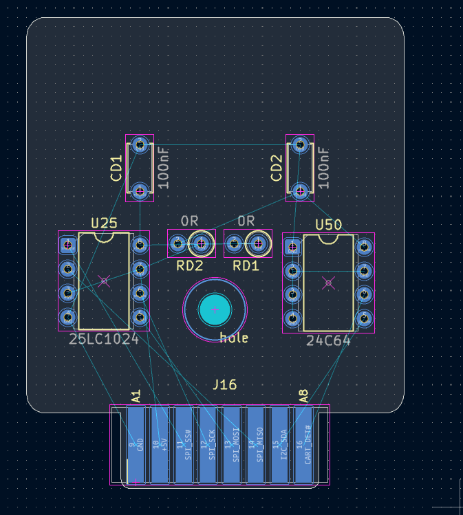
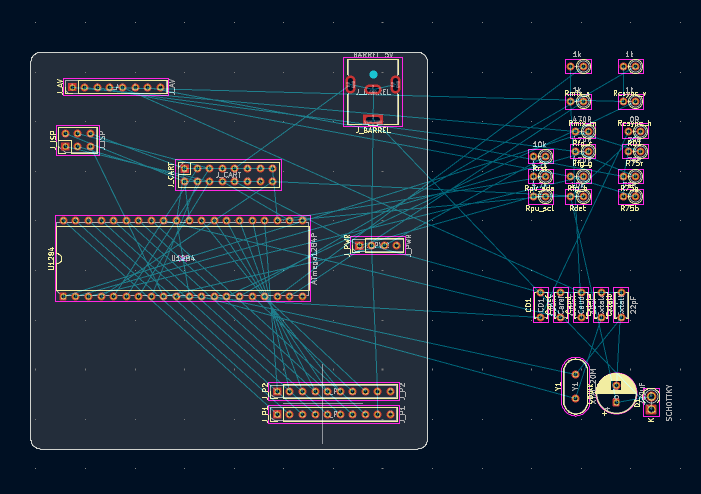
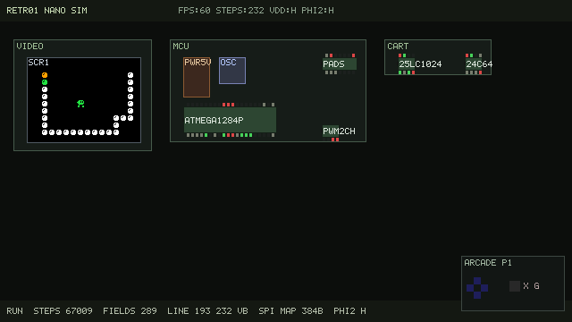
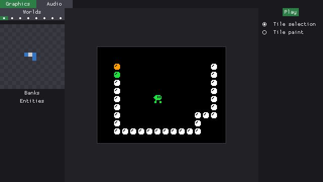

# Retr01 Nano

**The smallest, cutest, simplest cartridge-based dual gaming system (arcade + console).**

**Status: design + host runners + first SKiDL netlists.** Console firmware and PCB layout are still ahead of silicon. Console MCU is a fixed open ATmega1284P image. Games live on the cart.

Retr01 Nano is a **spiritual child** of [Retr01](../README.md): same 128-wide arcade language, far less hardware. One **ATmega1284P** runs a **fixed, open console firmware**. Games live on a **tiny dual-sided cartridge** (SPI EEPROM + save EEPROM). There is **no 6502** and **no external video ASIC**.

| | Retr01 (full) | Retr01 Nano |
|--|---------------|-------------|
| CPU / host | 6502 + MCUs | Single ATmega1284P @ 20 MHz (preferred) |
| Storage | Large cart flash + 24C64 | **Cute cart:** **25LC1024** (128 KB, DIP-8) + **24C64** (DIP-8) |
| Firmware | Cart PRG + MCU assists | **Fixed open** 1284 firmware (community-flashable) |
| Video | Multi-layer tile / sprite pipeline | 1 bpp tiles, attr FG color, **MAP only** (sprites TBD) |
| Worlds | Up to 8, rich MAP | Up to **8** worlds, **16** screens/world, **16x16** screen grid |
| Resolution (target) | 128x120 logical playfield | **128x96** logical, **256x192** RGBS via **2x** |
| Motion | Pixel scroll + streaming | **Instant screen switch only** |
| Players | 2P arcade GPIO | **2P** pads wired; game input TBD |
| Audio | Multi-channel APU path | **2 PWM channels** (music pulse + SFX), resistor-mixed |

Primary goal: a **minimal, stable 60 Hz** board with the smallest carts we can get away with, still feeling like Retr01. Video composes **128x96** and drives RGBS at **256x192** (2x). See [`docs/video.md`](docs/video.md).

## Host apps (Studio / Emu / Sim)

For now, **Nano Studio**, **Nano Emu**, and **Nano Sim** are **independent** trees under [`apps/`](apps/) (and root launchers). They may start as copies of the full Retr01 tools and diverge freely.

Later they are intended to **share common code** with the full Studio / Emu / Sim apps (shared libraries or extracted modules) instead of remaining permanent forks. Until that merge, prefer fixing Nano behavior in the Nano tree and keep full apps unchanged unless a change is deliberately shared.

**Apps:** [`apps/studio/`](apps/studio/) is Nano Studio. [`apps/emu/`](apps/emu/) is Nano Emu (MAP preview). [`apps/sim/`](apps/sim/) is the IC/netlist board. See [`apps/README.md`](apps/README.md).

| Runner | Picture | Host audio overlay |
|--------|---------|--------------------|
| Nano Studio Play | MAP preview (export + emu) | Yes |
| `./nano_emu` | MAP preview | No |
| `./nano_sim` | Soft compose MAP | No |

## Docs

| Doc | Topic |
|-----|--------|
| [`docs/overview.md`](docs/overview.md) | Goals, cuts, roadmap |
| [`docs/graphics.md`](docs/graphics.md) | Worlds, screens, attr byte, MAP compose |
| [`docs/video.md`](docs/video.md) | RGBS, 2x to 256x192, line buffers, VBlank loads |
| [`docs/memory_and_software.md`](docs/memory_and_software.md) | MCU vs cart budgets, open firmware, SDK |
| [`docs/cache_architecture.md`](docs/cache_architecture.md) | How 16 KB SRAM caches cart MAP/CHR without filling to the brim |
| [`docs/sound.md`](docs/sound.md) | 2-channel music + SFX PWM |
| [`docs/cart_format.md`](docs/cart_format.md) | `.r01proj` + `.r01nano` / 128 KB flash layout |
| [`docs/hardware.md`](docs/hardware.md) | Mobo + cute cart connector, BOM sketch |
| [`docs/pinmap.md`](docs/pinmap.md) | MCU PORT / PDIP-40 map, headers, cart edge |
| [`schematic_generator/`](schematic_generator/) | SKiDL -> `nano_mobo.net` + `nano_cart.net` |

From the repo root:

| Command | Role |
|---------|------|
| `./nano_studio [project.r01proj]` | Nano Studio (`bin/nano_studio` from `./build-all`) |
| `./nano_emu [cart.r01nano]` | Nano Emu MAP preview (`bin/nano_emu`) |
| `./nano_sim [cart.r01nano]` | Nano Sim: IC/netlist board UI (islands + DIPs + SCR), not a fullscreen emu |

Source concept notes also live in `temp/Retr01_Nano_Spec.md`. Where this tree disagrees, **these docs win**.

## Non-goals (v1)

- Compatibility with full Retr01 `.retr01` cart images or 36-pin edge
- Composite / NTSC encoder chips
- Hardware sprites, BG0, any screen scrolling
- Full Retr01 Sim netlist reuse

**Authoring:** Nano Studio exports `.r01nano` today (MAP + CHR). Console firmware / C SDK on the 1284 are still TBD. Direction: open **C** firmware/SDK plus a tiny assembly video kernel. Game data is authored onto the SPI cart image.

## Screenshots

## License / ownership

Same project umbrella as Retr01. Console firmware is intended to stay **open** for the community. See the parent repo for licensing when published.
